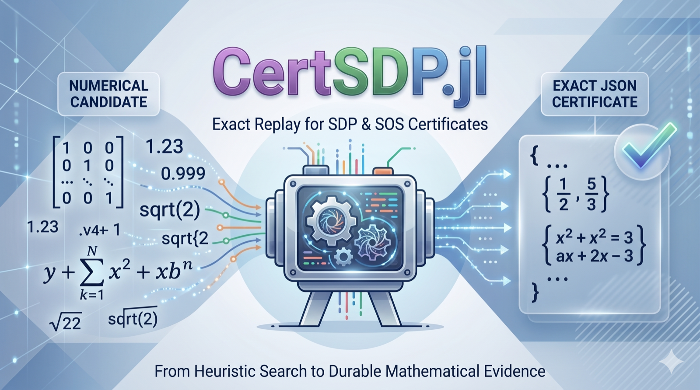
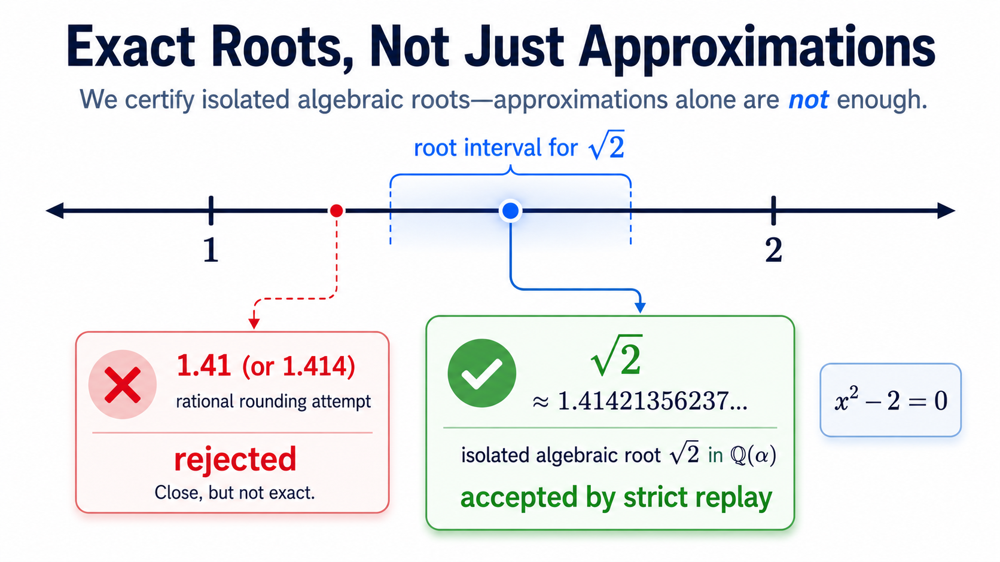

<div align="center">

# CertSDP.jl

[](https://github.com/fang251440/CertSDP.jl/actions/workflows/ci.yml)
[](https://github.com/fang251440/CertSDP.jl/actions/workflows/docs.yml)
[](https://github.com/fang251440/CertSDP.jl/actions/workflows/validation.yml)
[](Project.toml)
[](LICENSE)

**Exact replay for numerical SDP/SOS certificates.**

</div>

---

<p align="center">
  
</p>

CertSDP.jl turns numerical or symbolic SDP/SOS candidates into portable,
data-only JSON certificates that can be replayed independently with exact
rational or supported algebraic arithmetic.

```text
A solver finds a candidate. CertSDP makes it replayable.
```

> **CertSDP is not another large-scale SDP solver** and not a replacement for
> MOSEK, Clarabel, Hypatia, SCS, JuMP, or SumOfSquares.jl. It is the smaller
> trusted layer after search: **a certificate protocol plus a strict verifier**
> for artifacts that should survive review, archival, CI, and downstream proof
> pipelines.

## At A Glance

**Position:** CertSDP.jl is the exact replay layer between mathematical search
and durable mathematical evidence.

```text
solver output / Gram matrix / imported model
        -> exact certificate
        -> strict replay
        -> paper, CI, archive, or proof pipeline
```

| You Have | CertSDP Produces |
| --- | --- |
| **Numerical SDP/SOS candidates** | Portable JSON certificates with exact replay obligations. |
| **Rounded or symbolic Gram data** | SOS certificates checked by coefficient matching and exact PSD replay. |
| **SDPA, JuMP/MOI, or SumOfSquares-style artifacts** | Data-only replay bundles that separate extraction from trust. |
| **Algebraic candidates such as `sqrt(2)`** | Supported `QQ(alpha)` certificates with root isolation and certified signs. |

**Core promise:** search can be heuristic; acceptance is exact.

## Contents

- [At A Glance](#at-a-glance)
- [Why CertSDP Exists](#why-certsdp-exists)
- [Where CertSDP Fits](#where-certsdp-fits)
- [Five-Minute Quickstart](#five-minute-quickstart)
- [Strict Replay](#strict-replay)
- [Supported Certificate Families](#supported-certificate-families)
- [Signature Demo: Rational Rounding Fails](#signature-demo-rational-rounding-fails)
- [Validation Evidence](#validation-evidence)
- [Showcases](#showcases)
- [Platform Support](#platform-support)
- [Limitations](#limitations)
- [Documentation](#documentation)
- [Citation](#citation)
- [License](#license)

---

## Why CertSDP Exists

**A solver residual is not a proof, and a rounded Gram matrix is not a portable
certificate.**

Numerical SDP/SOS workflows are powerful, but solver residuals and rounded Gram
matrices are not portable proofs. They can fail on exactly the cases that matter
for rigorous research: degenerate feasible points, rank-deficient PSD faces,
weak feasibility, and algebraic coordinates such as `sqrt(2)`.

CertSDP focuses on the **next question after search**:

```text
Can this SDP/SOS claim be checked again, exactly,
without trusting the original solver run?
```

| Workflow state | Risk | CertSDP response |
| --- | --- | --- |
| Numerical output | Tolerance-based residuals can hide exact failure. | Treat as candidate data, not proof. |
| Rational rounding | Degenerate or algebraic solutions may not round to a valid rational point. | Certify over `QQ` or supported `QQ(alpha)` data. |
| Backend artifact | Logs, caches, and proof fields can be stale or solver-specific. | Recompute trusted obligations in strict replay. |

---

## Where CertSDP Fits

| Tool class | Role |
| --- | --- |
| JuMP / MathOptInterface / SumOfSquares.jl / SOSTOOLS | Model or export SDP/SOS problems. |
| MOSEK / Clarabel / Hypatia / SCS / SDPA | Find numerical candidates. |
| `msolve` / Sage | Optionally propose algebraic candidates. |
| CertSDP.jl | Verify exact replayable certificate artifacts. |

> **Use CertSDP.jl when** a solver result, Gram matrix, imported SDPA model, or
> algebraic candidate should become a reproducible artifact for a paper,
> reviewer, CI job, archive, or proof-assistant pipeline.

---

## Five-Minute Quickstart

**Requirements:** Julia 1.10 or newer and a checkout of this repository.

### Command Line

```bash
julia --project -e 'using Pkg; Pkg.instantiate()'

bin/certsdp certify examples/rational_problem.json \
  --solution examples/rational_solution.json \
  --out /tmp/certsdp-rational-cert.json

bin/certsdp verify --strict /tmp/certsdp-rational-cert.json
```

**Expected verifier result:**

```text
[OK] PSD verified over QQ
[OK] certificate accepted
```

This path uses exact rational data and no optional backend.

### Julia API

The same path through the Julia API:

```julia
using CertSDP

P = read_problem("examples/rational_problem.json")
result = certify(P, [1 // 2, 1 // 3])

verify(result) || error("certificate rejected")
write_certificate("/tmp/certsdp-rational-cert.json", result)

replay = read_certificate("/tmp/certsdp-rational-cert.json")
verify(replay) || error("replay rejected")
```

The public API is intentionally small and versioned. See
[API stability](docs/API_STABILITY.md) before depending on internals.

---

## Strict Replay

`certify` may use numerical diagnostics, rank guesses, optional algebraic
backends, caches, and heuristic candidate selection. `verify --strict` does not
trust those inputs as proof.

### Trusted Obligations

Strict replay recomputes the accepted obligations from certificate data:

- canonical problem and certificate hashes;
- exact rational or supported algebraic reconstruction;
- exact LMI substitution and SOS coefficient matching;
- algebraic root isolation by rational intervals;
- certified signs and exact PSD proof replay.

### Trust Boundary

| Trusted by strict replay | Not trusted as proof |
| --- | --- |
| v1.0 certificate data and canonical hashes | Solver success flags |
| Exact arithmetic in `QQ` or supported `QQ(alpha)` | Floating-point residuals or eigenvalues |
| Root isolation by rational intervals | Raw `msolve`, Sage, or solver logs |
| Exact substitution and coefficient matching | Cached backend artifacts |
| PSD proof replay by accepted exact methods | Approximate equalities, rounded diagnostics, or rank guesses |

**Design rule:**

```text
The certifier may be complicated. The verifier must remain small, exact, and auditable.
```

---

## Supported Certificate Families

### Core Verifier Support

**Core verifier support includes:**

- **Rational LMI certificates** over `QQ`;
- **one-root algebraic LMI certificates** over supported `QQ(alpha)`
  representations;
- **multi-block SDP/LMI replay** with shared variables;
- **PSD proof replay** by accepted exact methods:
  - principal minors;
  - Schur-zero replay;
  - fraction-free determinants;
  - LDL;
  - pivoted LDL;
  - blockwise replay;
- **exact SOS Gram certificates** with coefficient matching;
- **positive-polynomial schemas** for rational-function SOS and
  Putinar/Schmuedgen-style multiplier identities;
- **strict failure reports** for malformed, stale-hash, unsupported,
  approximate, or not-certified inputs.

### Workflow Support

**Workflow support includes:**

- **JSON schemas** for problems, certificates, and failure reports;
- **SDPA sparse import/export**;
- **replay bundles**;
- optional **JuMP/MOI extraction**;
- optional **SumOfSquares.jl extraction**;
- optional **`msolve` or Sage/msolve candidate generation**;
- **Optional numerical oracle:** Clarabel can provide approximate seeds and
  diagnostics.

> Optional components help with search and extraction. **They are not trusted by
> strict replay.**

### Example Commands

| Path | Command |
| --- | --- |
| Rational LMI | `bin/certsdp certify examples/rational_problem.json --solution examples/rational_solution.json --out /tmp/certsdp-rational-cert.json` |
| Algebraic LMI | `bin/certsdp certify examples/algebraic_problem.json --solution examples/algebraic_approx.json --out /tmp/certsdp-algebraic-cert.json --timeout 300` |
| SOS Gram | `bin/certsdp certify-sos examples/sos/gram_x2_plus_1.json --solution examples/sos/gram_x2_plus_1_solution.json --out /tmp/certsdp-sos-cert.json` |
| Multi-block SDPA | `bin/certsdp certify examples/sdpa/two_blocks.dat-s --solution examples/multiblock/sdpa_two_blocks_solution.json --out /tmp/certsdp-two-blocks-cert.json` |

Verify any generated certificate with:

```bash
bin/certsdp verify --strict <certificate.json>
```

---

## Signature Demo: Rational Rounding Fails

The motivating failure mode is a numerically convincing SDP point that cannot be
turned into a valid bounded-denominator rational certificate.

For example, a rational LMI can force `x = sqrt(2)`. No rational value of `x` is
feasible, so rational rounding fails even when the floating-point approximation
is excellent. CertSDP can represent the accepted solution algebraically and then
replay the certificate exactly.

<p align="center">
  
</p>

```bash
bin/certsdp certify examples/algebraic_problem.json \
  --solution examples/algebraic_approx.json \
  --out /tmp/certsdp-algebraic-cert.json \
  --timeout 300

bin/certsdp verify --strict /tmp/certsdp-algebraic-cert.json
```

`msolve` may help propose the algebraic candidate, but it is not part of the
trusted proof. Strict replay accepts only after root isolation, exact
substitution, certified signs, and PSD proof replay. See
[Why rational rounding fails](docs/why_rational_rounding_fails.md).

---

## Validation Evidence

CertSDP ships a public validation suite that is meant to be an evidence
contract, not a solver-speed leaderboard. The tracked v1.0 report includes
strong cases such as:

### Current Validation Snapshot

| Case | Representative rows | What it exercises |
| --- | --- | --- |
| **Degenerate algebraic SDP** | `validation__algebraic_direct_degree6_dim20`, `validation__algebraic_certifier_quartic_dim10_n2`, `validation__algebraic_sqrt2_unique` | Incidence-style algebraic certification, exact root replay, and rational-rounding failure. |
| **Mixed algebraic/rational block replay** | `validation__mixed_blocks_sqrt2_total22` | One algebraic block, one rational dense block, and one facial rank-deficient block, with exact proof method recorded block by block. |
| **Large multi-block SDP replay** | `validation__multiblock_dense_dim60_n20`, `validation__workflow_jump_moi_extract_multiblock_dim48` | Shared-variable block replay, dense block data, and imported JuMP/MOI-style workflow artifacts. |
| **SDPA and SOS imports** | `validation__workflow_sdpa_import_multiblock`, `validation__workflow_sumofsquares_extracted_sos`, `validation__sos_xy_square_nondiagonal` | Sparse SDPA import, exact Gram coefficient matching, non-diagonal Gram replay, and SOS extraction paths. |
| **Negative controls** | `validation__fake_rational_solution_rejected`, `validation__fake_sos_gram_rejected`, `validation__invalid_approximation_rejected` | Rejection of fake certificates, stale hashes, and infeasible approximate candidates with structured diagnostics. |

### Run The Contract

Run the validation contract from the repository root:

```bash
bin/certsdp doctor
julia --project scripts/run_validation.jl
```

See [benchmarks/VALIDATION_REPORT.md](benchmarks/VALIDATION_REPORT.md) and
[docs/validation.md](docs/validation.md). Certified rows must pass strict
verification. A passing solver log is not a passing certificate; strict replay
does not use `msolve`, numerical solver output, backend logs, or solver-specific
artifacts as proof.

---

## Showcases

The showcase pack contains data artifacts for recognizable positive-polynomial
certificate families. It is intended as a mathematical demo of the replay
protocol, not as a benchmark.

| Track | Examples |
| --- | --- |
| Non-SOS classics | Motzkin affine/homogeneous forms, Choi-Lam forms, and a Robinson-family SOS-threshold perturbation. |
| Hilbert 17 rational SOS | Explicit denominator SOS, numerator SOS, and exact `denominator * p == numerator` replay. |
| Putinar / Schmuedgen | Compact-domain inequalities on boxes, disks, intervals, simplex faces, and annuli. |
| SOSTOOLS bridge | Neutral SOSTOOLS-lite Gram exports converted into exact CertSDP certificates. |

### Run Or Regenerate

Run or regenerate the pack:

```bash
julia --project showcases/verify_all.jl
julia --project scripts/generate_showcase_pack.jl
```

See [showcases/README.md](showcases/README.md) and
[showcases/manifest.json](showcases/manifest.json).

---

## Platform Support

Linux and macOS run the full package, docs, and validation checks in CI.
Windows runs strict verifier smoke and docs syntax smoke. The core verifier
should run anywhere Julia 1.10+ runs; optional backends depend on local
installation.

---

## Limitations

CertSDP targets exact certification for supported small-to-medium audit and
reproducibility workflows. **It is not:**

- a generic large-scale SDP solver;
- a replacement for numerical SDP/SOS modeling and solver stacks;
- an infeasibility prover;
- a verifier for arbitrary floating-point model output without exact
  reconstruction;
- an automatic proof engine for every SDP/SOS hierarchy instance;
- a promise that every numerical SDP result can be certified.

Current boundaries are documented in [API stability](docs/API_STABILITY.md),
[Certificate format](docs/certificate_format.md), and
[Validation](docs/validation.md). Core verification does not require `msolve`,
JuMP, SumOfSquares.jl, Clarabel, or Sage; optional backends are used around
candidate generation and workflow integration.

---

## Documentation

**Start with:**

- [Installation](docs/installation.md)
- [Platform support](docs/platform_support.md)
- [Quickstart](docs/quickstart.md)
- [LMI tutorial](docs/lmi_tutorial.md)
- [SOS tutorial](docs/sos_tutorial.md)
- [SDPA import/export](docs/sdpa_import.md)
- [JuMP / MOI integration](docs/jump_moi_integration.md)
- [Workflows](docs/workflows.md)
- [Trust model](docs/trust_model.md)
- [Validation](docs/validation.md)
- [Certificate format](docs/certificate_format.md)
- [API reference](docs/api_reference.md)

**Build the local documentation site:**

```bash
julia --project=docs -e 'using Pkg; Pkg.develop(path=pwd()); Pkg.instantiate()'
julia --project=docs docs/make.jl
```

---

## Citation

The repository includes software citation metadata in `CITATION.cff` and
`codemeta.json`. It should not claim a registry entry or archived DOI until
those external services accept the artifact.

If CertSDP helps your research, cite **this software** and the paper that
motivates the degenerate SDP certification workflow:

```bibtex
@software{CertSDPjl,
  title   = {CertSDP.jl: Exact replay for SDP and SOS certificates},
  author  = {{CertSDP contributors}},
  year    = {2026},
  version = {1.0.0},
  note    = {Software package}
}
```

```bibtex
@article{KolmogorovNaldiZapata2025DegenerateSDP,
  author  = {Kolmogorov, Vladimir and Naldi, Simone and Zapata, Jeferson},
  title   = {Certifying Solutions of Degenerate Semidefinite Programs},
  journal = {SIAM Journal on Optimization},
  volume  = {35},
  number  = {3},
  pages   = {1630--1654},
  year    = {2025},
  doi     = {10.1137/24M1664691}
}
```

---

## License

CertSDP.jl is released under the Apache License 2.0. See [LICENSE](LICENSE).
Ignored local third-party materials under `references/` keep their own terms;
see [NOTICE.md](NOTICE.md).
