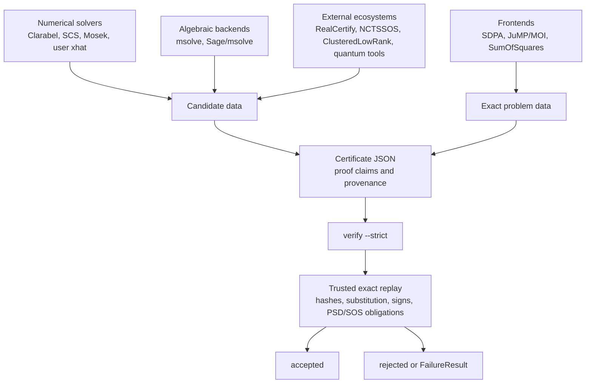

# Trust Model

CertSDP separates candidate generation from proof checking. The certifier may
use numerical solvers, rank heuristics, `msolve`, caches, exactification
strategies, external adapter metadata, and backend artifacts to find a
candidate. The verifier accepts a certificate only after replaying exact data.

## Boundary Diagram



Only the lower replay path is trusted. Candidate generators may be useful,
but their logs, residuals, and status codes are outside the proof boundary.

## Threat Model / Assumptions

The strict verifier is designed for replaying certificate data from an
untrusted or semi-trusted candidate-generation workflow. It assumes the local
CertSDP verifier code, Julia runtime, operating system, and hardware execute
correctly. It does not assume that the certificate provenance, solver status,
backend logs, cached artifacts, or supplied proof fields are honest.

Validation fixtures with `source.jl` files have a different boundary: the
validation harness executes trusted repository fixtures to test extraction
workflows. Certificate replay itself is data-only and `verify --strict` does
not execute benchmark source files.

## Trusted Base

The strict verifier trusts only:

- the CertSDP verifier code running locally;
- exact rational parsing and arithmetic over `QQ`;
- algebraic root isolation by rational intervals;
- exact arithmetic in the represented algebraic field `QQ(t)/(f)`;
- certified algebraic sign tests;
- exact substitution into the embedded LMI or SOS Gram problem;
- exact PSD proof replay by principal minors, Schur-zero, LDL, pivoted LDL, or
  blockwise replay;
- exact SOS coefficient matching for Gram certificates;
- exact positive-polynomial identities for rational-function,
  Positivstellensatz, and perturbation/compensation certificates;
- exact noncommutative word, trace-cyclic, involution, and relation-reduction
  checks for internal NC replay paths.

Strict mode is invoked as:

```bash
certsdp verify --strict cert.json
```

It requires a supported certificate shape, an embedded problem, a matching `problem_hash`, a
`certificate_id`, and complete exact proof fields.

## Not Trusted

The verifier does not trust:

- numerical solver status, residuals, eigenvalues, or rank estimates;
- `msolve` stdout, backend logs, artifact paths, or cached backend output;
- RealCertify, NCTSSOS, ClusteredLowRankSolver.jl, CertifiedQuantumBounds, or
  paper-benchmark logs as proof;
- certificate provenance;
- approximate equality claims or tolerances;
- substituted matrices, determinants, Schur complements, LDL pivots, or SOS
  coefficient tables written in the certificate without recomputation.

These fields can be useful for diagnostics, but they are not proof. In strict
mode, approximate-equality and backend-dependent proof methods are rejected.
Backend logs in provenance are ignored and cannot make a bad certificate pass.

## Data-Only Certificates

Certificates are JSON data. Verifying a certificate does not execute code from
the certificate and does not run an external solver. Anyone can verify a strict
certificate in an environment with no numerical solver and no `msolve`.

## Verification Flow

For an LMI certificate, strict verification does:

```text
schema and certificate-family check
problem hash recomputation
certificate hash recomputation
exact solution reconstruction
exact LMI substitution
exact proof-data recomputation
exact PSD verification
```

For an SOS Gram certificate, strict verification additionally recomputes
coefficient matching and verifies the embedded rational or supported algebraic
PSD certificate. Positive-polynomial certificates replay their explicit
polynomial identities. External replay artifacts are accepted only after the
translated CertSDP certificate passes the same strict boundary.

## Certifier Boundary

`certify` is allowed to be heuristic. It can use approximate solutions, rank
profiles, incidence systems, algebraic backends, and saved artifacts. Its output
is not trusted until `verify` accepts it.

`verify --strict` is the independent replay boundary. It rejects unsupported certificate
shapes and requires a complete exact proof surface so that success is independent
of solver availability and backend artifacts.

## External Adapter Boundary

External adapters are intentionally untrusted translators. A RealCertify,
NCTSSOS, ClusteredLowRankSolver.jl, CertifiedQuantumBounds, or paper-benchmark
artifact can contribute exact candidate data only after it is converted into
CertSDP certificate data or an external replay artifact. The parser rejects
raw solver output, backend logs, floating residuals, and session transcripts in
the proof surface. Metadata may describe where a candidate came from, but only
CertSDP replay can make it accepted.
