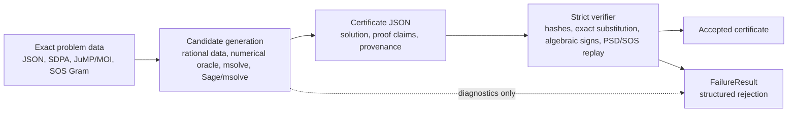

# Workflows

This page connects the Julia API, CLI, imported frontends, and certificate
formats. The rule is the same in every workflow: candidate generation may use
heuristics, but acceptance is exact replay.

## Trust Boundary Diagram



Numerical solver output, backend logs, cached backend output, and certificate
provenance never cross into the trusted proof base. They can explain where a
candidate came from, but they cannot make verification pass.

## Certificate Anatomy

| Field group | What it records | What verifier recomputes |
| --- | --- | --- |
| Schema and hashes | `certsdp_certificate_version`, `certificate_type`, `certificate_id`, `problem_hash` | v1.0 shape, embedded problem hash, certificate hash |
| Problem data | Exact LMI, block LMI, or SOS Gram problem | Canonical exact problem and dimensions |
| Solution data | Rational coordinates or one-root algebraic representation | Coordinate parsing, root isolation, exact field arithmetic |
| Proof data | PSD method, pivots/minors/Schur data, block proofs, SOS matches | Exact substitution, determinants, signs, Schur complements, coefficient matching |
| Provenance | Optional backend, timing, artifact, and diagnostic metadata | Nothing for acceptance; provenance is ignored by strict replay |

## Result Wrappers

`certify` and `certify_sos` return one of two internal result wrappers:
`CertSDP.CertifiedResult` or `CertSDP.FailureResult`. The concrete types are
module-qualified implementation details, but the behavior is public:

```julia
using CertSDP

P = read_problem("examples/rational_problem.json")
result = certify(P, [1//2, 1//3])

verify(result)                         # true for CertifiedResult
write_certificate("cert.json", result) # supported public path
```

Failure results are first-class diagnostics:

```julia
bad = certify(P, [-10//1, 0//1])

verify(bad)       # false
diagnose(bad)     # v1.0 failure-report data
```

Use `verify(result)` to branch in application code rather than matching on
concrete wrapper types.

## API, CLI, And Frontend Map

| Source workflow | Julia API | CLI | Certificate family |
| --- | --- | --- | --- |
| Exact rational LMI JSON | `certify(read_problem(path), rational_vector)` | `certsdp certify problem.json --solution approx.json` | `rational_psd_certificate` |
| SDPA sparse block SDP | `certify(read_problem("case.dat-s"), rational_vector)` | `certsdp certify case.dat-s --solution solution.json` | `block_rational_psd_certificate` |
| Algebraic LMI candidate | `certify(problem, approx; algebraic_backend=:msolve)` | `certsdp certify problem.json --solution approx.json --timeout 300` | `algebraic_psd_certificate` or blockwise algebraic certificate |
| Numerical seed then exact replay | `solve_approximately`, `diagnose`, `certify` | `certsdp solve-certify problem.json --cert-out cert.json` | Depends on the exact certificate produced |
| JuMP/MOI affine PSD model | Optional extension extraction, then `certify` | Validation harness source fixture or extracted JSON | Block LMI certificate |
| Exported SOS Gram JSON | `certify_sos(problem, gram)` | `certsdp certify-sos problem.json --solution gram.json` | `sos_gram_certificate` |
| SumOfSquares-style extraction | Optional extension extraction, then `certify_sos` | Validation harness source fixture or extracted JSON | `sos_gram_certificate` |

## Independent Replay

The independent replay path is intentionally short:

```bash
bin/certsdp verify --strict cert.json
bin/certsdp bundle cert.json --out artifact.zip
bin/certsdp replay artifact.zip
```

`bundle` packages data and redacted sidecar metadata. `replay` ignores backend
logs and reruns strict exact verification on the certificate.
