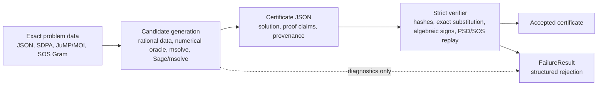

# Workflows

This page connects the Julia API, CLI, imported frontends, and certificate
formats. The rule is the same in every workflow: candidate generation may use
heuristics, but acceptance is exact replay.

## Trust Boundary Diagram



Numerical solver output, backend logs, cached backend output, and certificate
provenance never cross into the trusted proof base. They can explain where a
candidate came from, but they cannot make verification pass.

## Certificate Anatomy

| Field group | What it records | What verifier recomputes |
| --- | --- | --- |
| Schema and hashes | `certsdp_certificate_version`, `certificate_type`, `certificate_id`, `problem_hash` | supported shape, embedded problem hash, certificate hash |
| Problem data | Exact LMI, block LMI, or SOS Gram problem | Canonical exact problem and dimensions |
| Solution data | Rational coordinates or one-root algebraic representation | Coordinate parsing, root isolation, exact field arithmetic |
| Proof data | PSD method, pivots/minors/Schur data, block proofs, SOS matches | Exact substitution, determinants, signs, Schur complements, coefficient matching |
| Provenance | Optional backend, timing, artifact, and diagnostic metadata | Nothing for acceptance; provenance is ignored by strict replay |

## Result Wrappers

`certify` and `certify_sos` return one of two internal result wrappers:
`CertSDP.CertifiedResult` or `CertSDP.FailureResult`. The concrete types are
module-qualified implementation details, but the behavior is public:

```julia
using CertSDP

P = read_problem("examples/rational_problem.json")
result = certify(P, [1//2, 1//3])

verify(result)                         # true for CertifiedResult
write_certificate("cert.json", result) # supported public path
```

Failure results are first-class diagnostics:

```julia
bad = certify(P, [-10//1, 0//1])

verify(bad)       # false
diagnose(bad)     # structured failure-report data
```

Use `verify(result)` to branch in application code rather than matching on
concrete wrapper types.

## API, CLI, And Frontend Map

| Source workflow | Julia API | CLI | Certificate family |
| --- | --- | --- | --- |
| Exact rational LMI JSON | `certify(read_problem(path), rational_vector)` | `certsdp certify problem.json --solution approx.json` | `rational_psd_certificate` |
| SDPA sparse block SDP | `certify(read_problem("case.dat-s"), rational_vector)` | `certsdp certify case.dat-s --solution solution.json` | `block_rational_psd_certificate` |
| Algebraic LMI candidate | `certify(problem, approx; algebraic_backend=:msolve)` | `certsdp certify problem.json --solution approx.json --timeout 300` | `algebraic_psd_certificate` or blockwise algebraic certificate |
| Numerical seed then exact replay | `solve_approximately`, `diagnose`, `certify` | `certsdp solve-certify problem.json --cert-out cert.json` | Depends on the exact certificate produced |
| JuMP/MOI affine PSD model | Optional extension extraction, then `certify` | Validation harness source fixture or extracted JSON | Block LMI certificate |
| Exported SOS Gram JSON | `certify_sos(problem, gram)` | `certsdp certify-sos problem.json --solution gram.json` | `sos_gram_certificate` |
| Approximate SOS Gram JSON | `CertSDP.certify_auto_sos(problem, gram; tolerance=...)` | `certsdp certify-auto-sos problem.json --solution gram.json --tolerance tol` | `sos_gram_certificate` after round-project exactification |
| SumOfSquares-style extraction | Optional extension extraction, then `certify_sos` | Validation harness source fixture or extracted JSON | `sos_gram_certificate` |
| Algebraic SOS Gram over `QQ(alpha)` | Module-qualified constructor, then `verify` | Legacy-schema replay after translation | `algebraic_sos_gram_certificate` |
| Positive-polynomial identity | Explicit rational squares and multipliers | Certificate replay or showcase fixtures | `rational_function_sos_certificate`, `positivstellensatz_certificate`, or `perturbation_compensation_sos_certificate` |
| External exact-certificate ecosystem | Translate with adapter boundary, then `verify` | External replay artifact fixture | CertSDP certificate embedded in `ExternalReplayArtifact` |
| Reviewer artifact directory | `CertSDP.write_paper_artifact(dir, cert)` | `certsdp bundle` / `certsdp replay` for zip bundles | Data-only artifact, not a new certificate family |

## Exactification Strategies

`certify-auto-sos` is the first strategy-based exactification entrypoint. It
tries direct exact replay, then `sos_round_project`, which reconstructs a
rational Gram candidate, projects it onto the exact coefficient-matching affine
space, and hands the result to the existing SOS verifier. Strategy diagnostics
are provenance only; the certificate is accepted only when strict replay accepts
the resulting JSON artifact.

Other roadmap strategies, such as perturbation/compensation, field-extension
low-rank SOS, noncommutative projection, and quantum-bound bridges, are held
module-qualified until their proof obligations are replayable by CertSDP's
stable public API.

## External Adapter Boundary

Adapters for RealCertify, NCTSSOS, ClusteredLowRankSolver.jl, and
CertifiedQuantumBounds are translation contracts. They may carry metadata about
the source tool and the original search workflow, but acceptance depends only
on the translated CertSDP certificate.

An external replay artifact is accepted only when:

- the embedded translated certificate is CertSDP certificate data;
- `verify --strict` accepts that certificate;
- the artifact hash matches the translated data;
- forbidden trust fields such as raw solver output, backend logs, session
  transcripts, and floating residuals are absent.

This makes external ecosystems useful sources of candidates without making
their logs part of CertSDP's trusted base.

## Reviewer Artifacts

For paper or artifact-evaluation use, a reviewer directory should contain the
minimum data needed to re-check the claim from a fresh checkout:

```julia
using CertSDP

result = certify_sos("examples/sos/gram_x2_plus_1.json", [1 0; 0 1])
verify(result) || error("certificate rejected")
CertSDP.write_paper_artifact("/tmp/certsdp-review", result;
                             title="SOS replay artifact")
```

The directory includes `certificate.json`, `manifest.json`,
`strict_replay.txt`, `snippet.tex`, `provenance.json`, and `README.md`.
Generation fails unless strict replay accepts the certificate locally.

## Independent Replay

The independent replay path is intentionally short:

```bash
bin/certsdp verify --strict cert.json
bin/certsdp bundle cert.json --out artifact.zip
bin/certsdp replay artifact.zip
```

`bundle` packages data and redacted sidecar metadata. `replay` ignores backend
logs and reruns strict exact verification on the certificate.
